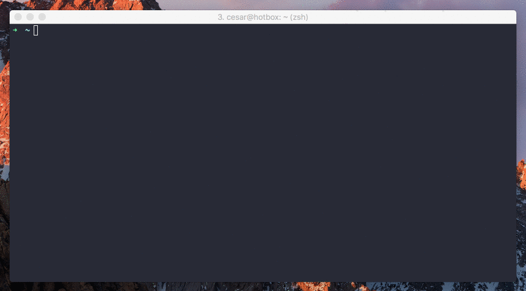

# gito

[](https://badge.fury.io/rb/gito)
[](https://travis-ci.org/cesarferreira/gito)
[](https://codeclimate.com/github/cesarferreira/gito)

git helper tool to **clone**/**open**/**auto-install**/**edit** a git project with a one-liner.


<p align="center">

</p>

<p align="center">
  > <strong>gito</strong> <i>cesarferreira/dryrun -e</i>
</p>

## Why?
A lot of times I find myself wanting to try some code from github and in order to do so I have to copy the git URL, go to the terminal, git clone, find out the folder name, go to the folder and based on the type of project I need to `bundle install`, `./gradlew assemble`, `npm install`, `pip install .`, `mix deps.get`, `make install`, you name it. And after that opening it in my text editor of choice... Not anymore!


## Usage

```bash
$ gito -h
Usage: gito GIT_URL [OPTIONS]

Options
    -s, --set-editor EDITOR          Set a custom editor to open the project (e.g. "atom", "subl", "vim", etc.
    -e, --edit                       Open the project on an editor
    -o, --open                       Open the project on Finder
    -d, --dryrun                     Does not install the dependencies
    -t, --temp                       Clones the project into a temporary folder
    -k, --keep                       Clones the whole git history and not just the last snapshot
    -h, --help                       Displays help
    -v, --version                    Displays the version
```

Examples:
```bash
# git clone this https://github.com/cesarferreira/dryrun
gito cesarferreira/dryrun

# git clone, install, open and edit the project
gito cesarferreira/dryrun --edit --open

# git clone on a operating system /temp/ folder, install, and edit the project
gito cesarferreira/dryrun --edit --temp

# set the editor to be 'subl' from now on
gito cesarferreira/dryrun -s subl

# git clone, install, open and edit the project from github on a temp folder
gito https://github.com/cesarferreira/dryrun -e -o -t

# git clone, install from another git source
gito https://bitbucket.org/username/project
```

## Installation

    $ gem install gito

## Supported type detections/auto-intalls
So far it auto-installs these types:
- Ruby
- Gradle
- node.js
- C/C++
- Elixir
- Python
- Go (Govendor, Glide)
- Cocoapods
- Carthage
- Swift Package Manager
- Rust

Create a pull request by editing [detector.json](detector.json) file if you want more types to be added.

## Internally what happens?

When you run this:
```bash
gito cesarferreira/dryrun --edit --open
```
This will happen:
```bash
# clone
git clone http://github.com/cesarferreira/dryrun

# change directory
cd dryrun

# open an editor of choice if --editor flag
atom .

# open the folder if --open flag
open .

# find out what kind of project it is
project_type_detector

# because `ruby` was detected
bundle install
```

## Contributing
I welcome and encourage all pull requests. It usually will take me within 24-48 hours to respond to any issue or request. Here are some basic rules to follow to ensure timely addition of your request:
  1. If its a feature, bugfix, or anything please only change code to what you specify.
  2. Please keep PR titles easy to read and descriptive of changes, this will make them easier to merge :)
  3. Pull requests _must_ be made against `develop` branch. Any other branch (unless specified by the maintainers) will get rejected.
  4. Check for existing [issues](https://github.com/cesarferreira/gito/issues) first, before filing an issue.
  5. Have fun!

### Created & Maintained By
[Cesar Ferreira](https://github.com/cesarferreira) ([@cesarmcferreira](https://www.twitter.com/cesarmcferreira))
